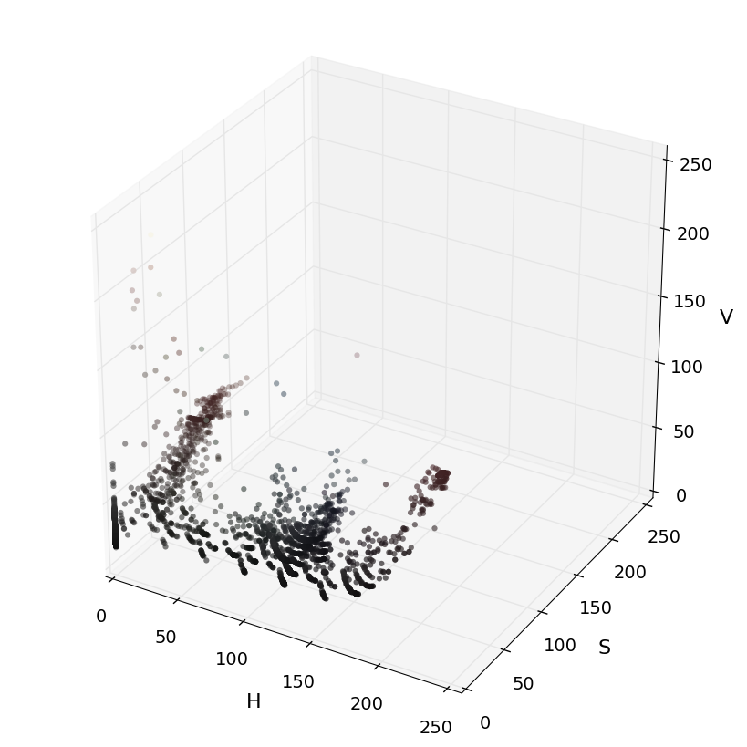

# Vehicle Detection and Tracking

The goal of this project to extract features HOG SVM learning using the vehicle to detect and track the position of the frame in the video stream and on the other hand, convolution neural network using the network to the same function.

The different approaches are shown below.

Support Vector Machine(SVM)   |  Convolution Neural Network
:----------------------------:|:------------------------------:
    | 

The project is completed in the following stages:

- Phase 1: Extract HOG features from car and no car images. after build dataset to train a classifier.
- Phase 2: Train a SVM classifier to identify vehicles.
- Phase 3: Identify vehicles in video frame.
- Phase 4: Create Heatmap and tracking vehicles.

### Explore Color Space
(`.ipynb`: `Explore different approaches to feature generation`)
- Color histogram test, use histogram of pixel intensity features
cars[101] images above as an example 

This will be one of the characteristics of the image.

- RGB, HSV and YCrCb color space explorer using the same image.

RGB                        |  HSV                      |  YCC
:-------------------------:|:-------------------------:|:-------------------------:
       |       | 

Look at the distribution of the color values of each pixel in the color space.

### Extract HOG features
(`.ipynb`: `Classifiers, Project Solution - 1`)

The HOG feature is extracted by the get_hog_features method, and the figure below shows the histogram of the orientation gradient of the image, testing the parameters.

The HOG visualization is a representation of the dominant gradient direction with the brightness corresponding to the gradient intensity in each cell, rather than the feature vector. It is known that the YUV color space gives the best performance, so i decided to use it.

The determination of the HOG parameter should be based on experimental results and is selected through several tests. A small number of 300 data sets were sampled and generated and stored as pickle files.

The selected parameter is
Orient = 11, Pix_per_cell = 16, Cell_per_block = 2, Hog_channel = ALL

### Train a SVM classifier

I used LinearSVC from the sklearn library.
The data set provided by udacity for the project is the same number of car and nocar, so no separate sampling process is performed and the number of data finally used is as follows.

- Number of training examples = 14208
- Number of testing examples = 3552
- Number of valid train examples = 14208
- Number of valid test examples = 3552

### Sliding Window Search
