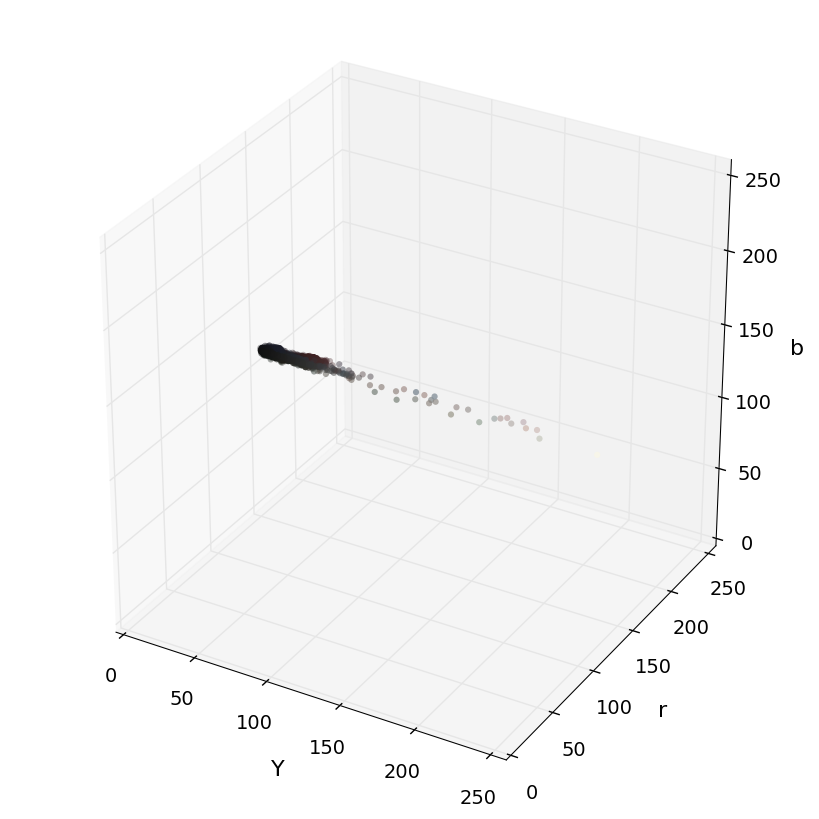

# Vehicle Detection and Tracking

The goal of this project to extract features HOG SVM learning using the vehicle to detect and track the position of the frame in the video stream and on the other hand, convolution neural network using the network to the same function.

The different approaches are shown below.

Support Vector Machine(SVM)   |  Convolution Neural Network
:----------------------------:|:------------------------------:
    | 

The project is completed in the following stages:

- Phase 1: Extract HOG features from car and no car images. after build dataset to train a classifier.
- Phase 2: Train a SVM classifier to identify vehicles.
- Phase 3: Identify vehicles in video frame.
- Phase 4: Create Heatmap and tracking vehicles.

### Explore Color Space
- Color histogram test, use histogram of pixel intensity features
cars[101] images above as an example 

This will be one of the characteristics of the image.

- RGB, HSV and YCrCb color space explorer using the same image.

RGB                        |  HSV                      |  YCC
:-------------------------:|:-------------------------:|:-------------------------:
       |       | 

Look at the distribution of the color values of each pixel in the color space.
### Extract HOG features
The HOG feature is extracted by the get_hog_features method, and the figure below shows the histogram of the orientation gradient of the image, testing the parameters.
